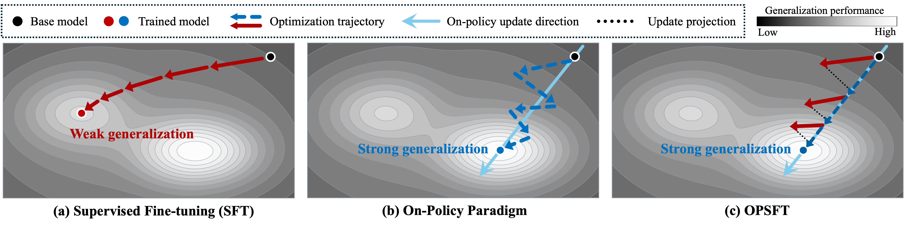
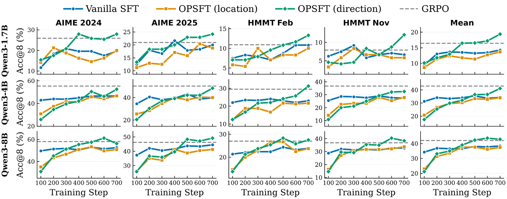

# On-Policy Parameter-Update Directions Underlie Generalization in LLM Post-Training

Official code for **OPSFT (On-Policy Direction-constrained Supervised Fine-Tuning)** — a method that constrains SFT parameter updates to the on-policy parameter-update direction identified by GRPO.

<p align="center">
  
</p>

## Overview

On-policy post-training has emerged as an effective paradigm for enhancing the reasoning capabilities of large language models (LLMs), demonstrating strong generalization across tasks and domains. However, the mechanism underlying this strong generalization remains under debate. We investigate the parameter-update behavior of on-policy and off-policy paradigms and find that, unlike off-policy SFT, on-policy training identifies a sparse parameter-update direction that continuously adapts in both location and orientation.

OPSFT retains the efficiency of off-policy SFT while constraining updates to an on-policy parameter-update direction. Once this direction is identified, even off-policy training can generalize more effectively. This enables both efficient post-training and continued improvement of an already post-trained model using newly acquired trajectories.

<p align="center">
  
</p>

## Quick Start: Download Assets and Compare Vanilla SFT vs. OPSFT

The fastest reproduction path does **not** require trajectory generation or GRPO training. Download our released teacher-verified trajectories and matching merged GRPO checkpoint, identify the on-policy direction locally, then train Vanilla SFT and OPSFT from the same base model.

> **Released assets**: teacher-verified trajectories are hosted in the [SFT-Trajectories dataset](https://huggingface.co/datasets/shufanshen/SFT-Trajectories); GRPO checkpoints are hosted as individual model repositories in the [OPSFT collection](https://huggingface.co/collections/shufanshen/opsft-6aa781ffb646c53df3707a3b).

### 1. Environment and Base Model

Follow [environment setup](docs/environment.md), then download the base model:

```bash
export ROOT=/path/to/OPSFT
export BASE_MODEL=/path/to/Qwen3-4B
export TRAJECTORIES_REPO=shufanshen/SFT-Trajectories
cd "${ROOT}"
```

### 2. Download Released Assets

Released trajectories come from [`shufanshen/SFT-Trajectories`](https://huggingface.co/datasets/shufanshen/SFT-Trajectories), while GRPO checkpoints are model repositories:

| Domain | Teacher-verified trajectories | Matching 4B GRPO checkpoint |
|--------|-------------------------------|-----------------------------|
| Math (DeepMath) | `math/deepmath_qwen3_30b_trajectories/{train,validation}.parquet` | [`shufanshen/Qwen3-4B-GRPO-DeepMath-150-steps`](https://huggingface.co/shufanshen/Qwen3-4B-GRPO-DeepMath-150-steps) |
| Code (CodeEurus) | `code/eurus_qwen3_30b_trajectories/{train,validation}.parquet` | [`shufanshen/Qwen3-4B-GRPO-CodeEurus-150-steps`](https://huggingface.co/shufanshen/Qwen3-4B-GRPO-CodeEurus-150-steps) |

Download either domain into the repository root. Dataset paths are preserved, and each model repository is saved to the local path consumed by `run_extract_subspace.sh`:

```bash
# Math assets
huggingface-cli download "${TRAJECTORIES_REPO}" --repo-type dataset --local-dir . \
  --include 'math/deepmath_qwen3_30b_trajectories/*'
huggingface-cli download shufanshen/Qwen3-4B-GRPO-DeepMath-150-steps \
  --local-dir math/qwen3_4b_deepmath_grpo150

# Code assets
huggingface-cli download "${TRAJECTORIES_REPO}" --repo-type dataset --local-dir . \
  --include 'code/eurus_qwen3_30b_trajectories/*'
huggingface-cli download shufanshen/Qwen3-4B-GRPO-CodeEurus-150-steps \
  --local-dir code/qwen3_4b_eurus_grpo150
```

### 3. Identify the Downloaded Direction

The released GRPO directories are standard merged Hugging Face checkpoints. Identify the mask and direction locally so their provenance and selection setting are explicit:

```bash
# Math
BASE_MODEL="${BASE_MODEL}" \
TRAINED_MODEL=math/qwen3_4b_deepmath_grpo150 \
OUTPUT_DIR=analysis/quickstart_math_grpo150_exact_support \
SELECTION=exact_support \
  bash run_extract_subspace.sh

# Code
BASE_MODEL="${BASE_MODEL}" \
TRAINED_MODEL=code/qwen3_4b_eurus_grpo150 \
OUTPUT_DIR=analysis/quickstart_code_grpo150_exact_support \
SELECTION=exact_support \
  bash run_extract_subspace.sh
```

### 4. Math: Train Both SFT Variants

Both runs start from the same Qwen3-4B base model and use the same verified trajectories. The only difference is the OPSFT constraint.

```bash
# Vanilla SFT
MODEL_PATH="${BASE_MODEL}" \
TRAIN_FILES=math/deepmath_qwen3_30b_trajectories/train.parquet \
VAL_FILES=math/deepmath_qwen3_30b_trajectories/validation.parquet \
OUTPUT_ROOT=checkpoints/quickstart_math_vanilla \
SFT_VARIANT=full \
TOTAL_TRAINING_STEPS=700 LR=1e-7 MODEL_DTYPE=fp32 \
EVAL_DOMAIN=math STAGES=train,eval \
  bash run_sft.sh

# OPSFT
MODEL_PATH="${BASE_MODEL}" \
TRAIN_FILES=math/deepmath_qwen3_30b_trajectories/train.parquet \
VAL_FILES=math/deepmath_qwen3_30b_trajectories/validation.parquet \
OUTPUT_ROOT=checkpoints/quickstart_math_opsft \
SFT_VARIANT=opsft \
SFT_SUBSPACE_DIR=analysis/quickstart_math_grpo150_exact_support \
TOTAL_TRAINING_STEPS=700 LR=1e-7 MODEL_DTYPE=fp32 \
EVAL_DOMAIN=math STAGES=train,eval \
  bash run_sft.sh
```

### 5. Code: Train Both SFT Variants

```bash
# Vanilla SFT
MODEL_PATH="${BASE_MODEL}" \
TRAIN_FILES=code/eurus_qwen3_30b_trajectories/train.parquet \
VAL_FILES=code/eurus_qwen3_30b_trajectories/validation.parquet \
OUTPUT_ROOT=checkpoints/quickstart_code_vanilla \
SFT_VARIANT=full \
TOTAL_TRAINING_STEPS=700 LR=1e-7 MODEL_DTYPE=fp32 \
EVAL_DOMAIN=code STAGES=train,eval \
  bash run_sft.sh

# OPSFT
MODEL_PATH="${BASE_MODEL}" \
TRAIN_FILES=code/eurus_qwen3_30b_trajectories/train.parquet \
VAL_FILES=code/eurus_qwen3_30b_trajectories/validation.parquet \
OUTPUT_ROOT=checkpoints/quickstart_code_opsft \
SFT_VARIANT=opsft \
SFT_SUBSPACE_DIR=analysis/quickstart_code_grpo150_exact_support \
TOTAL_TRAINING_STEPS=700 LR=1e-7 MODEL_DTYPE=fp32 \
EVAL_DOMAIN=code STAGES=train,eval \
  bash run_sft.sh
```

> `STAGES=train,eval` automatically evaluates the final checkpoint. Math uses AIME 2024/2025 and HMMT 2025; code uses HumanEval+, MBPP+, and LiveCodeBench v6. See the task guides for benchmark setup and detailed options.

### Published GRPO Checkpoint Catalogue

All released checkpoints are available from the [OPSFT collection](https://huggingface.co/collections/shufanshen/opsft-6aa781ffb646c53df3707a3b). Download a checkpoint whose base model matches `BASE_MODEL`, then use its local directory as `TRAINED_MODEL` in `run_extract_subspace.sh`.

| Domain | Base model | 50 steps | 100 steps | 150 steps |
|--------|------------|----------|-----------|-----------|
| DeepMath | Qwen3-1.7B | [model](https://huggingface.co/shufanshen/Qwen3-1.7B-GRPO-DeepMath-50-steps) | [model](https://huggingface.co/shufanshen/Qwen3-1.7B-GRPO-DeepMath-100-steps) | [model](https://huggingface.co/shufanshen/Qwen3-1.7B-GRPO-DeepMath-150-steps) |
| DeepMath | Qwen3-4B | [model](https://huggingface.co/shufanshen/Qwen3-4B-GRPO-DeepMath-50-steps) | [model](https://huggingface.co/shufanshen/Qwen3-4B-GRPO-DeepMath-100-steps) | [model](https://huggingface.co/shufanshen/Qwen3-4B-GRPO-DeepMath-150-steps) |
| DeepMath | Qwen3-8B | [model](https://huggingface.co/shufanshen/Qwen3-8B-GRPO-DeepMath-50-steps) | [model](https://huggingface.co/shufanshen/Qwen3-8B-GRPO-DeepMath-100-steps) | [model](https://huggingface.co/shufanshen/Qwen3-8B-GRPO-DeepMath-150-steps) |
| CodeEurus | Qwen3-4B | — | [model](https://huggingface.co/shufanshen/Qwen3-4B-GRPO-CodeEurus-100-steps) | [model](https://huggingface.co/shufanshen/Qwen3-4B-GRPO-CodeEurus-150-steps) |

## Documentation

| Guide | Contents |
|-------|----------|
| [Environment Setup](docs/environment.md) | Installation, models, datasets, and benchmark dependencies |
| [Code Task](docs/code.md) | Full Eurus pipeline: trajectory generation → GRPO → direction identification → SFT → code evaluation |
| [Math Task](docs/math.md) | Full DeepMath/DAPO pipeline: trajectory generation → GRPO → direction identification → SFT → math evaluation |
| [Application 1: Training Efficiency](docs/application_efficiency.md) | Short GRPO direction identification followed by short OPSFT |
| [Application 2: Post-Training Improvement](docs/application_continual_posttraining.md) | Reuse a post-trained model's direction with newly acquired trajectories |

## Directory Structure

```
OPSFT/
├── README.md
├── docs/
│   ├── environment.md
│   ├── code.md
│   ├── math.md
│   ├── application_efficiency.md
│   └── application_continual_posttraining.md
├── figs/                              # Paper figures used in this README
├── run_generate_trajectories.sh       # Generate verified SFT trajectories
├── run_merge_trajectory_shards.sh     # Merge sharded trajectory outputs
├── run_grpo.sh                        # GRPO training
├── run_extract_subspace.sh            # Direction identification (legacy filename)
├── run_sft.sh                         # Vanilla SFT or OPSFT
├── run_code_eval.sh                   # Code evaluation
├── math_eval/                         # Math evaluation
└── verl/                              # Training framework (FSDP2 SFT + GRPO)
```

## Citation

```bibtex
@inproceedings{opsft2027,
  title={On-Policy Parameter-Update Directions Underlie Generalization in LLM Post-Training},
  year={2027},
  booktitle={Arxiv},
}
```
